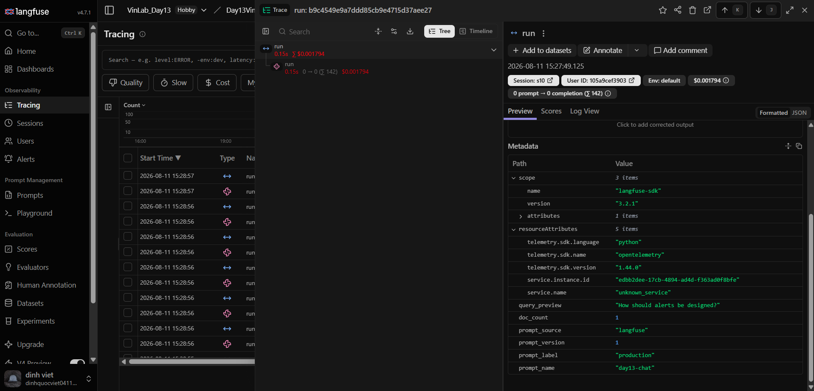
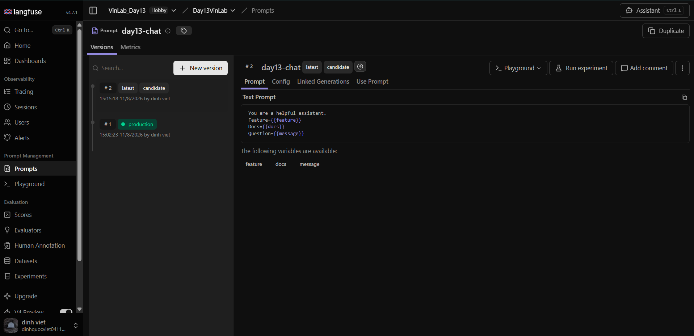

# Báo cáo Day 13 Observability

## 1. Thông tin nhóm

- Tên nhóm: Nhóm LPV
- Repository URL: https://github.com/phunh1901/Day13-K4-Observability-LPV
- Commit SHA cuối: lấy tại thời điểm nộp bằng `git rev-parse HEAD`
- Thành viên và vai trò:
  - Ngô Hoàng Phú: Role A — Logging & PII (Correlation ID, Context Metadata, PII Redaction)
  - Đinh Quốc Việt: Role B — Tracing & Prompt Versioning (Langfuse Traces, Prompt v1/v2, Version Labels & Rollback)
  - Nguyễn Trung Long: Role C — Dashboard, SLO & Alerts (6 Panel Dashboard, SLOs, Alert Rules & Runbook)

## 2. Kết quả kỹ thuật

- Điểm `validate_logs.py`: 100/100 sau khi merge Role A CP1 (`submission/evidence/cp2-log-validator.txt`)
- Tổng số traces: >= 10; nhóm ghi nhận 264+ traces trong project Langfuse. Evidence danh sách: `submission/evidence/traces-list.png`.
- Số PII leak còn lại: 0
- Link/đường dẫn dashboard: `/dashboard`; runtime data `/dashboard/data`; snapshot `submission/evidence/cp2-dashboard-runtime.json`


### Baseline trước khi merge Role A CP1

--- Lab Verification Results ---
Total log records analyzed: 21
Records with missing required fields: 20
Records with missing enrichment (context): 20
Unique correlation IDs found: 0
Potential PII leaks detected: 0

--- Grading Scorecard (Estimates) ---
- [FAILED] Missing required fields (ts, level, etc.)
- [FAILED] Correlation ID propagation (less than 2 unique IDs)
- [FAILED] Log enrichment (missing user_id_hash, etc.)
+ [PASSED] PII scrubbing

Estimated Score: 30/100


### After merge Role A CP1
--- Lab Verification Results ---
Total log records analyzed: 21
Records with missing required fields: 0
Records with missing enrichment (context): 0
Unique correlation IDs found: 10
Potential PII leaks detected: 0

--- Grading Scorecard (Estimates) ---
+ [PASSED] Basic JSON schema
+ [PASSED] Correlation ID propagation
+ [PASSED] Log enrichment
+ [PASSED] PII scrubbing

Estimated Score: 100/100

## 3. Logging và tracing

- Evidence correlation ID và PII redaction: `submission/evidence/log-correlation-pii.jsonl` chứa cặp `request_received`/`response_sent` thật có cùng correlation ID, đủ context metadata và giá trị PII đã được thay bằng `[REDACTED_*]`.
- Evidence trace waterfall: 
- Giải thích một span đáng chú ý: Span `run` thể hiện toàn bộ quy trình sinh câu trả lời của agent, đo lường latency (0.15s), tính toán chi phí ($0.001794), gắn nhãn session/user_id_hash và trích xuất đúng prompt managed `day13-chat` v1 từ Langfuse.

## 4. Prompt versioning

- Prompt name: day13-chat
- Version/label baseline: v1 (production)
- Version/label candidate: v2 (candidate)
- Trace ID của mỗi version:
  - Baseline (v1 / production): `b9c4549e9a7ddd85cb9e4715d37aee27`
  - Candidate (v2 / candidate): `29936f94fca5f071e230b77d574cf0c2`
- Bằng chứng version/label hiện tại: `submission/evidence/prompt-versions.png` hiển thị v1=`production`, v2=`candidate`.
- Bằng chứng rollback trực quan: `submission/evidence/prompt-v2-production-before-rollback.png` và `submission/evidence/prompt-v1-production-after-rollback.png`.


## 5. Dashboard, SLO và alerts

- Kết quả `validate_dashboard.py`: `HỢP LỆ: 6/6 panel`; xem `submission/evidence/cp2-dashboard-validator.txt`.
- Evidence dashboard: `submission/evidence/cp2-dashboard-runtime.json` chứa dữ liệu thật của đủ sáu panel trong cửa sổ 60 phút; ảnh UI tại `submission/evidence/cp2-dashboard.png`.
- SLO đã chọn và lý do: P95 <= 3000 ms, error rate <= 2%, daily cost <= 2.50 USD và quality trung bình >= 0.75. Các ngưỡng phản ánh tail latency, độ tin cậy, ngân sách và chất lượng đầu ra; cùng giá trị được dùng trong dashboard và `config/slo.yaml`.
- Alert rules và runbook: `config/alert_rules.yaml` có HighTailLatency cảnh báo sớm từ 2000 ms trước SLO 3000 ms, HighRequestErrorRate và DailyCostBudgetRisk; owner, duration, user impact, bước điều tra và mitigation nằm trong `docs/alerts.md`.

## 6. Điều tra challenge

- Challenge ID: `day13-k4-observability-v1`
- Triệu chứng từ metrics: Tail latency P95 tăng đột biến vượt ngưỡng 2000ms (đạt ~2650ms), tập trung chủ yếu ở các request thuộc feature `monitoring`.
- Trace ID liên quan: `830e202f4edbdb24b6cbea131f32eca0` (Langfuse ghi nhận generation `run` 2.652s và child span `rag_retrieve` 2.501s).
- Log line/correlation ID liên quan: `correlation_id: req-55d79463`
  ```json
  {"service": "api", "latency_ms": 2651, "tokens_in": 35, "tokens_out": 120, "cost_usd": 0.001905, "quality_score": 0.8, "event": "response_sent", "model": "claude-sonnet-4-5", "session_id": "k4-challenge-s01", "env": "dev", "feature": "monitoring", "user_id_hash": "f00ba60b3772", "correlation_id": "req-55d79463", "level": "info", "ts": "2026-08-11T13:36:18.692653Z"}
  ```
- Root cause: Cờ incident `rag_slow` trong `app/mock_rag.py` ở trạng thái `True`, kích hoạt `time.sleep(2.5)` làm chậm quá trình truy xuất văn bản RAG.
- Fix action: Mitigation đã thực hiện là tắt cờ incident bằng API `/incidents/rag_slow/disable` (hoặc `python scripts/inject_incident.py --disable`). Fix code được đề xuất là timeout 2.0s cho retrieval kèm fallback; không tuyên bố đã triển khai timeout.
- Preventive measure: Alert `HighTailLatency` cảnh báo sớm khi P95 > 2000ms trong 5m, trước SLO 3000ms; đề xuất thêm Circuit Breaker và fallback response khi RAG timeout.
- Evidence tổng hợp: `submission/evidence/challenge-investigation.md`. `trace-waterfall.png` là baseline; waterfall challenge có span `rag_retrieve` riêng được lưu tại `submission/evidence/challenge-trace-waterfall.png`.

## 7. Đóng góp cá nhân

| Thành viên | Phần việc | Commit/PR | Điều đã học |
|---|---|---|---|
| Ngô Hoàng Phú | Role A — Logging, Correlation ID & PII Redaction | `f009dca`, `975d592` | Hiểu cách lan truyền Correlation ID xuyên suốt HTTP request và cách scrub PII dữ liệu nhạy cảm trước khi lưu JSON log. |
| Đinh Quốc Việt | Role B — Tracing & Prompt Versioning | `a25dfb4` | Hiểu cách gắn metadata cho Trace/Generation trên Langfuse và quy trình đổi label/rollback prompt an toàn. |
| Nguyễn Trung Long | Role C — Dashboard, SLO & Alerts | `287ea96`, `e415399`, `0487ef6` | Thấu hiểu contract 6 panel dashboard, cách định nghĩa SLI/SLO và xây dựng Alert rule kèm Runbook sự cố. |

## 8. Bonus

- Real LLM provider và cost optimization: benchmark paired 5 input thật qua OpenAI Responses API (`gpt-5.6-luna`) cho thấy output token giảm 42.42% (693 xuống 399), estimated cost giảm 40.56% (0.004349 USD xuống 0.002585 USD), quality proxy giữ nguyên 0.88. Prompt/answer không được lưu trong evidence và PII được scrub trước khi gửi provider. Evidence: `submission/evidence/bonus-real-llm-cost-before-after.json`.
- Audit log riêng: control action được ghi vào `data/audit.jsonl`, có correlation ID và PII scrubbing. Evidence: `submission/evidence/bonus-audit-log.jsonl`.
- Automation: `scripts/verify_submission.py` chạy tests, validators, secret scan, diff check và evidence gate. Evidence: `submission/evidence/bonus-submission-verification.json`.
- Thiết kế, lệnh chạy và giới hạn dữ liệu: `docs/BONUS.md`.
